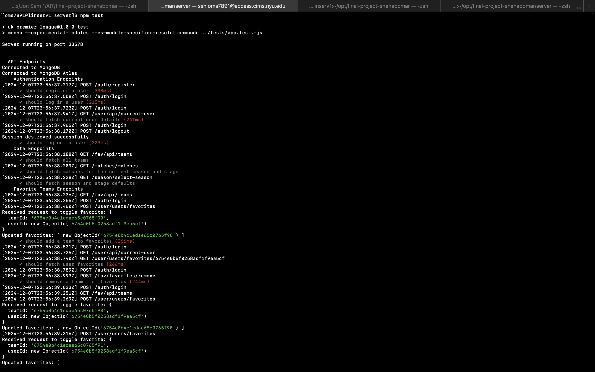
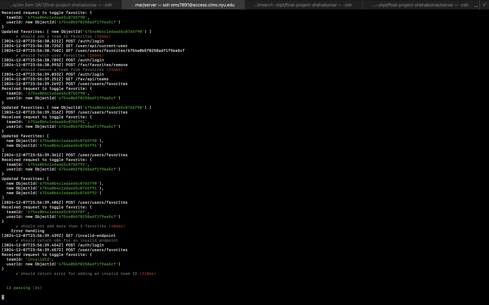

Milestone 04 - Final Project Documentation
===

NetID
---
oms7891

Name
---
Omar Shehab

Repository Link
---
https://github.com/nyu-csci-ua-0467-001-002-fall-2024/final-project-shehabomar

URL for deployed site
---
http://linserv1.cims.nyu.edu:33578/

URL for form 1 (from previous milestone)
---
http://linserv1.cims.nyu.edu:33578/login

Special Instructions for Form 1
---
The form requires authentication. Users must have an account to access it. If you don’t have an account, you can register using the registration form:  
http://linserv1.cims.nyu.edu:33578/register

URL for form 2 (for current milestone)
---
http://linserv1.cims.nyu.edu:33578/user

Special Instructions for Form 2
---
Form 2 allows authenticated users to select their favorite teams. Users must log in before accessing this feature. 
The favorites list can include a maximum of three teams.

Special Instructions for Form 3
---
No Special instructions, just when you try to access the seasons use the format given on the website.
http://linserv1.cims.nyu.edu:33578/select-season

First link to github line number(s) for constructor, HOF, etc.
---
https://github.com/nyu-csci-ua-0467-001-002-fall-2024/final-project-shehabomar/blob/master/client/src/components/pages/standingTable.jsx#L36

Second link to github line number(s) for constructor, HOF, etc.
---
https://github.com/nyu-csci-ua-0467-001-002-fall-2024/final-project-shehabomar/blob/master/client/src/components/pages/standingTable.jsx#L67

Short description for links above
---
Use of `.some()` : \
For each fav (favorite team) in the array, it checks if the _id of the favorite (converted to a string) is equal to teamId.
If at least one team in the favorites array matches the teamId, the HOF returns true, otherwise, it returns false.
Purpose:
The isFavorite function tells if a given team is one of the user's favorite teams.
The .some() function efficiently checks if the team is present in the favorites array.
\
Use of `.map()` : \
For each team in standings, it returns a new table row (`<tr>`) containing information about the team (like name, points, wins, losses, and draws).
Each row also includes logic to check if the team is one of the user's favorites using the isFavorite(team._id) function.
If the team is a favorite, the row is given the table-warning class to highlight it.

Link to github line number(s) for schemas (db.js or models folder)
---
https://github.com/nyu-csci-ua-0467-001-002-fall-2024/final-project-shehabomar/blob/master/server/db.mjs#L3 

https://github.com/nyu-csci-ua-0467-001-002-fall-2024/final-project-shehabomar/blob/master/server/db.mjs#L26

https://github.com/nyu-csci-ua-0467-001-002-fall-2024/final-project-shehabomar/blob/master/server/db.mjs#L33

https://github.com/nyu-csci-ua-0467-001-002-fall-2024/final-project-shehabomar/blob/master/server/db.mjs#L45

Description of research topics above with points
---

### React: 6 points 
#### Description of Usage: 
- Built a responsive and interactive frontend using React.
- Used functional components and React hooks like `useState`, `useEffect`, and custom context hooks (`useAppContext`, `useFavoriteTeamsContext`) to manage global state.
- Created reusable components for forms (Login, Register, Season Selector), tables (Standings Table), and dynamic lists (Favorite Teams).
- Utilized React Router to manage client-side routing for pages like `/login`, `/register`, `/user`, `/standings`, and `/select-season`.
- Used conditional rendering to display feedback messages, loading spinners, and error alerts.
- Built reusable, clean, and maintainable code by separating components into pages, layouts, and contexts. 

### Bootstrap: 2 points 
#### Description of Usage: 
- Incorporated Bootstrap for consistent styling and layout.
- Used responsive classes to ensure that components are fully responsive on different screen sizes.
- Added custom-styled buttons, alert messages, and modals using Bootstrap classes like `btn`, `btn-primary`, `alert`, and `form-control`.
- Used Bootstrap icons to create a modern look and feel for form inputs, buttons, and interactive UI elements.
- Used Bootstrap's grid system (`col-md-4`, `row`, `container`) to create responsive layouts for the main page, forms, and user dashboards.

### Unit testing Mocha: 3 points
#### Description of Usage: 
- Wrote unit tests for backend API endpoints using Mocha and Chai.
- Created tests for all essential endpoints, including authentication (`/auth/login`, `/auth/register`), user favorites (`/user/users/favorites`, `/user/api/current-user`), data endpoints (`/matches`, `/season/select-season`), and error handling (like `404` routes).
- Used Supertest to simulate HTTP requests and ensure that server routes behave as expected.
- Verified that HTTP status codes, response bodies, and error messages were correct for both successful and error cases.
- Wrote before and after hooks to seed and clean up test databases for a clean testing environment.
- Used assertions to check if user authentication works correctly, database data is returned properly, and favorites are limited to three items.

### passport.js: 2 points 
#### Description of Usage:
- Implemented user authentication and session management using `Passport.js`.
- Created a local strategy for user login using Passport's `passport-local` module.
- Used Express session to manage session persistence, ensuring users remain logged in between requests.
- Built endpoints to support user login, logout, and session verification (`/auth/login`, `/auth/logout`, `/user/api/current-user`).
- Ensured that only authenticated users can access specific routes like `/user`, `/users/favorites`, and favorite team toggles.
- Protected routes using Passport middleware with `passport.authenticate('local')`.

### Football API: 2 points
#### Description of Usage:
- Used the Football Data API and CSV imports to fetch and load real-world football match data into the system.
- Built a **season selection system** where users can import CSV data from football-data.co.uk and view match results for a selected season and league.
- Used the `csv-parse` library to parse CSV files into JSON and **stored football matches and team information in MongoDB**.
- Created an API to dynamically fetch and display match results and team standings for selected seasons and stages (`/matches`, `/standings`).
- Created a fully interactive UI where users can explore match data, teams, and current standings in a clean, organized format.

Links to github line number(s) for research topics described above (one link per line)
---

### React: 
https://github.com/nyu-csci-ua-0467-001-002-fall-2024/final-project-shehabomar/blob/master/client/src/components/shared/Navbar.jsx#L6
https://github.com/nyu-csci-ua-0467-001-002-fall-2024/final-project-shehabomar/blob/master/client/src/context/appContext.js#L10
https://github.com/nyu-csci-ua-0467-001-002-fall-2024/final-project-shehabomar/blob/master/client/src/components/pages/mainPage.jsx#L8

### Bootstrap:
https://github.com/nyu-csci-ua-0467-001-002-fall-2024/final-project-shehabomar/blob/master/client/src/components/shared/Navbar.jsx#L27
https://github.com/nyu-csci-ua-0467-001-002-fall-2024/final-project-shehabomar/blob/master/client/src/components/auth/loginForm.jsx#L48

### Unit Testing:
https://github.com/nyu-csci-ua-0467-001-002-fall-2024/final-project-shehabomar/blob/master/tests/app.test.mjs#L9
https://github.com/nyu-csci-ua-0467-001-002-fall-2024/final-project-shehabomar/blob/master/tests/app.test.mjs#L44
https://github.com/nyu-csci-ua-0467-001-002-fall-2024/final-project-shehabomar/blob/master/tests/app.test.mjs#L86

### passport.js:
https://github.com/nyu-csci-ua-0467-001-002-fall-2024/final-project-shehabomar/blob/master/server/routes/authRouter.mjs#L23
https://github.com/nyu-csci-ua-0467-001-002-fall-2024/final-project-shehabomar/blob/master/server/routes/authRouter.mjs#L29

### Football API:
https://github.com/nyu-csci-ua-0467-001-002-fall-2024/final-project-shehabomar/blob/master/server/routes/seasonRouter.mjs#L22

Optional project notes
--- 
- Authentication Required: Key parts of the app (like user favorites) require the user to log in. Use the login and register forms.
- Team Favorites: Users can only select up to 3 favorite teams, and attempts to add more than 3 favorites will result in a validation error.
- Season and Stage Selection: Use proper season formatting (e.g., 2324) to load correct match data.
- When running the `app.test.mjs`, since the website is going to be running on the same port as the test file so it will give an error but it's going to pass all tests given if tested from the deployment server.

Attributions
---
### React
- File: https://github.com/nyu-csci-ua-0467-001-002-fall-2024/final-project-shehabomar/blob/master/client/src/components/shared/Navbar.jsx#L6 
    - Attribution: The Navbar component logic and layout are inspired by standard React functional components and use of React Router for navigation. 
    - Resource Link: https://coreui.io/react/docs/components/navbar/ 
- File: https://github.com/nyu-csci-ua-0467-001-002-fall-2024/final-project-shehabomar/blob/master/client/src/context/appContext.js#L10 
    - Attribution: The global state management logic with useContext and useReducer is adapted from React Context API documentation and patterns. 
    - Resource Link: https://react.dev/reference/react/useContext 
  
- File: https://github.com/nyu-csci-ua-0467-001-002-fall-2024/final-project-shehabomar/blob/master/client/src/components/pages/mainPage.jsx#L8 
    - Attribution: The Main Page component's logic and component rendering method are based on React's component-based development principles and documentation. 
    - Resource Link: https://legacy.reactjs.org/docs/components-and-props.html 
  
### Bootstrap
- File: https://github.com/nyu-csci-ua-0467-001-002-fall-2024/final-project-shehabomar/blob/master/client/src/components/shared/Navbar.jsx#L27 
    - Attribution: The responsive navigation bar layout, use of container, row, and Bootstrap grid classes were adapted from Bootstrap's official documentation on Navbar layouts. 
    - Link: https://getbootstrap.com/docs/4.0/components/navbar/ 
  
- File: https://github.com/nyu-csci-ua-0467-001-002-fall-2024/final-project-shehabomar/blob/master/client/src/components/auth/loginForm.jsx#L48
    - Attribution: The Login Form's layout and styling follow Bootstrap form design patterns, with the use of .form-control and .btn-primary for inputs and buttons. 
    - Link: https://getbootstrap.com/docs/5.0/forms/form-control/ 

### Unit Testing (Mocha, Chai, and Supertest)
- File: https://github.com/nyu-csci-ua-0467-001-002-fall-2024/final-project-shehabomar/blob/master/tests/app.test.mjs#L9 
    - Attribution: Unit testing for API routes was inspired by best practices from Mocha, Chai, and Supertest documentation for end-to-end testing of HTTP requests and responses. 
    - Link: https://mochajs.org 

### Passport.js
- File: https://github.com/nyu-csci-ua-0467-001-002-fall-2024/final-project-shehabomar/blob/master/server/routes/authRouter.mjs#L23 
    - Attribution: The logic for setting up Passport.js and using the local strategy for authentication is inspired by the Passport.js official documentation and tutorials on Express and Passport integration. 
    - Link: https://www.passportjs.org/packages/passport-local/

