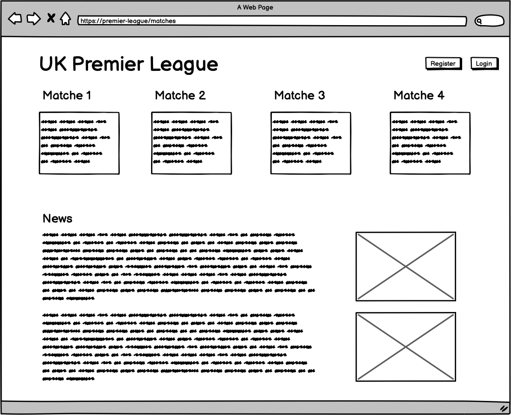
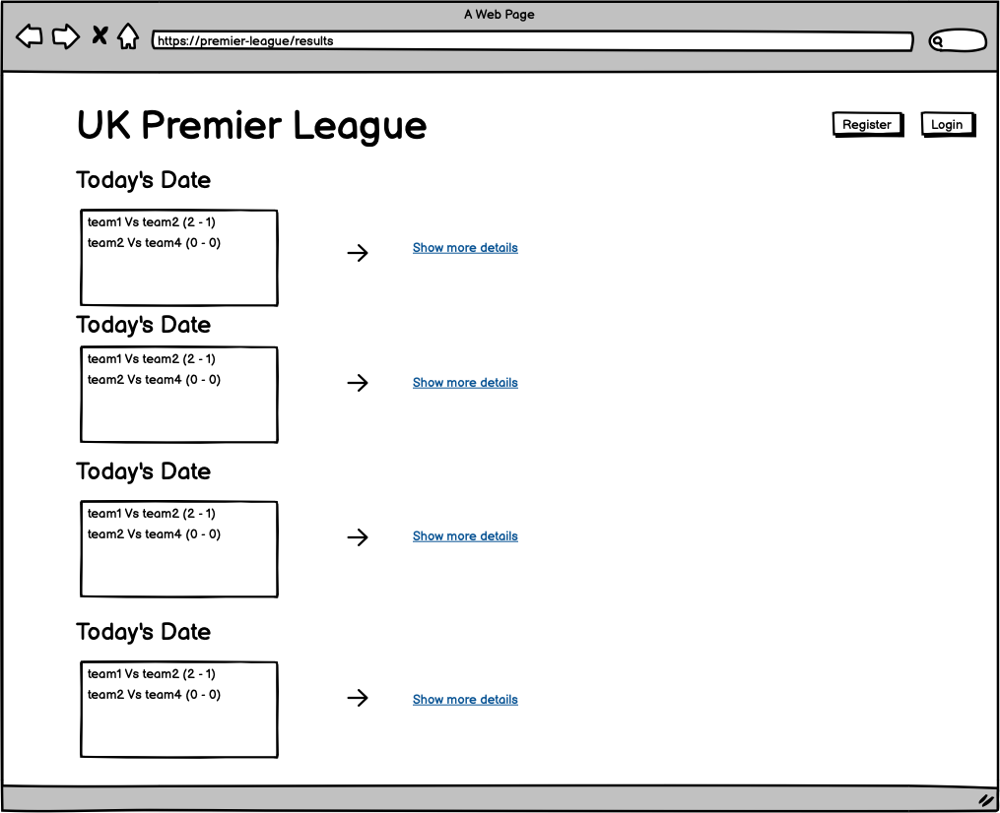

# UK Premier League Website

## Overview

A UK Premier League application that allows users to view the latest match results, team standings, and analysis of recent matches. It also provides information on teams and players, making it a go-to source for Premier League fans.

## Data Source
To provide accurate and up-to-date information on Premier League matches and standings, this application will retrieve data from one of the following football data APIs:

- **[Football-Data.org](https://www.football-data.org/)**: A reliable API that provides free-tier access to Premier League match data, standings, and team information. It requires setting up an API key for use.
- **[API-FOOTBALL](https://www.api-football.com/)**: A popular choice for comprehensive football data, offering match results, standings, team stats, and player information. It also requires an API key, and the free plan includes daily limits.
- **[SportdataAPI](https://www.sportdataapi.com/)**: Provides access to match results, standings, and other stats for Premier League and other leagues, with a free tier that includes basic data.

## Data Model

### Sample Documents

1. **Match Document**: Represents a single match and its stats.
    ```json
    {
      "_id": "ObjectId",
      "team1": "Manchester United",
      "team2": "Liverpool",
      "score": { "team1": 2, "team2": 1 },
      "date": "2024-10-27",
      "stats": {
        "possession_team1": 60,
        "possession_team2": 40,
        "shots_on_target_team1": 8,
        "shots_on_target_team2": 6
      }
    }
    ```
  - **Description**: Stores match details, scores, and basic stats (e.g., possession, shots on target).

2. **Team Document**: Represents a single team in the league.
    ```json
    {
      "_id": "ObjectId",
      "name": "Manchester United",
      "points": 24,
      "wins": 8,
      "losses": 2,
      "draws": 1
    }
    ```
  - **Description**: Stores team statistics including points, wins, losses, and draws. Links indirectly to matches where the team participated.

3. **User Document**: Stores registered user information.
    ```json
    {
      "_id": "ObjectId",
      "username": "john_doe",
      "email": "john@example.com",
      "password": "hashed_password",
      "favorites": ["Manchester United", "Liverpool"]
    }
    ```
- **Description**: Stores user data, including a hashed password, email, and favorite teams for a personalized experience.

### Relationships
- **Match-Team Relationship**: The `team1` and `team2` fields in the `Match` document can reference team IDs for direct linking.
- **User-Favorite Teams**: The `favorites` field in the `User` document stores team names or IDs, linking users to their preferred teams.

## [First Database Draft](server/db.mjs) 

## Wireframes

/premier-league/ - main page of the website


/premier-league/matches - page for showing all upcomming matches



/premier-league/results - page for showing results of matches that happened during the week (or specific time interval)



## Site Map


## User Stories
1. As a user, I want to view the latest match results to stay updated with the current Premier League standings.
2. As a user, I want to see team standings to understand my team’s position in the league.
3. As a user, I want to view match details to analyze the performance of both teams.

## Research Topics

1. **Unit Testing with Mocha** (3 points)
    - **What**: Using Mocha to test the application’s routes and data handling.
    - **Why**: To ensure reliable application functionality and accuracy in match and standings data.
    - **Solution**: Mocha with a minimum of 4 tests to verify critical features.

2. **Front-End Framework (React)** (6 points)
    - **What**: Using React for building dynamic components.
    - **Why**: React enables smooth, interactive UI updates for match results and standings.
    - **Solution**: Use React to build components for viewing match data and standings.

3. **CSS Framework (Bootstrap)** (2 points)
    - **What**: Bootstrap for styling components.
    - **Why**: Bootstrap provides a ready-made and responsive design with customizable components.
    - **Solution**: Customize Bootstrap classes for layout and design of each page.


## [First Draft for App](server/app.mjs) 

## Annotations / References Used

- Passport.js for Authentication
Reference: Passport Documentation
Use: Handling user login, registration, and session management.
- React for Front-End Development
Reference: React Documentation
Use: Creating reusable components like team lists, standings tables, and match result displays.
- Bootstrap for CSS Styling
Reference: Bootstrap Documentation
Use: Styling the front end, ensuring consistency and ease of customization across different screen sizes.
- Mongoose for MongoDB Interaction
Reference: Mongoose Documentation 
Use: Defining data models for teams, matches, and users, and managing database queries.
- Mocha for Unit Testing
Reference: Mocha Documentation 
Use: Ensuring functionality and accuracy, especially for routes retrieving data like match results and standings.
